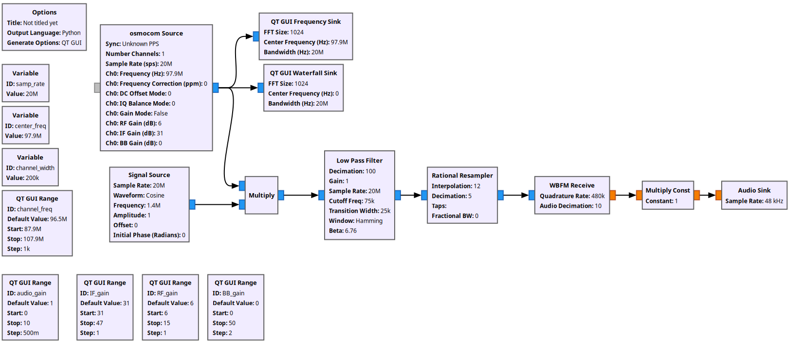
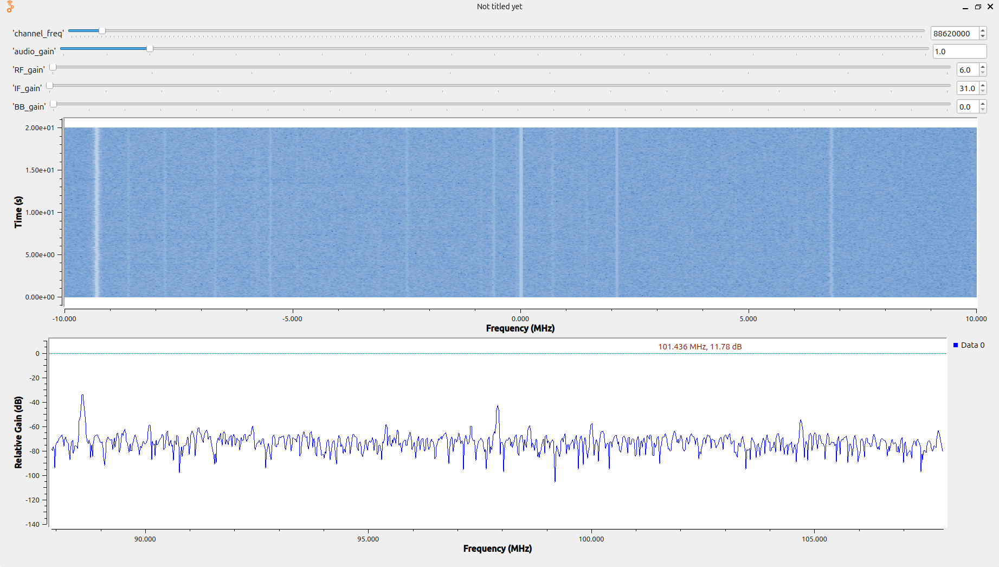

# FM Receiver in GNU Radio

This repository contains an FM receiver implemented in **GNU Radio**.  
The flowgraph receives FM broadcast signals and uses an FFT waterfall display to easily identify available channels.

## Contents
- `FM_Reciver_GNU_Radio.grc` – GNU Radio Companion flowgraph
- `FM_Reciver_flowgraph.png` – Flowgraph overview
- `FM_waterfall_FFT_Rx.png` – Waterfall/FFT display of received FM channels

## Flowgraph

## Waterfall Display
The waterfall plot helps visualize the FM spectrum and makes it easier to identify active channels.

